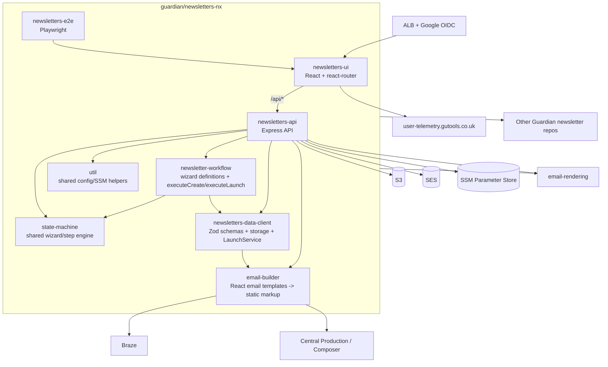

# Architecture

For architecture details inside `email-rendering`, see its own doc: [guardian/email-rendering/docs/architecture.md](https://github.com/guardian/email-rendering/blob/main/docs/architecture.md).

## Workspace shape (pnpm workspaces, Nx commands from repo root)

This repository is a pnpm workspace (`apps/*`, `libs/*`) and commands are run from the workspace root (`pnpm -r ...` in root scripts). CI and e2e config use Nx command entrypoints (`pnx ...`) from that same root context.

- Workspace config: [`pnpm-workspace.yaml`](../pnpm-workspace.yaml), [`package.json`](../package.json), [`.github/workflows/ci.yml`](../.github/workflows/ci.yml), [`apps/newsletters-e2e/playwright.config.ts`](../apps/newsletters-e2e/playwright.config.ts)

### Apps

- `newsletters-api`: API server registering `drafts`, `newsletters`, `currentStep`, `notifications`, `layouts`, `rendering-templates`, `user`, and `healthcheck` routes.
  - [`apps/newsletters-api/src/main.ts`](../apps/newsletters-api/src/main.ts)
  - [`apps/newsletters-api/src/app/routes/drafts.ts`](../apps/newsletters-api/src/app/routes/drafts.ts)
  - [`apps/newsletters-api/src/app/routes/newsletters.ts`](../apps/newsletters-api/src/app/routes/newsletters.ts)
  - [`apps/newsletters-api/src/app/routes/currentStep.ts`](../apps/newsletters-api/src/app/routes/currentStep.ts)
  - [`apps/newsletters-api/src/app/routes/notifications.ts`](../apps/newsletters-api/src/app/routes/notifications.ts)
  - [`apps/newsletters-api/src/app/routes/layouts.ts`](../apps/newsletters-api/src/app/routes/layouts.ts)
  - [`apps/newsletters-api/src/app/routes/rendering-templates.ts`](../apps/newsletters-api/src/app/routes/rendering-templates.ts)
  - [`apps/newsletters-api/src/app/routes/user.ts`](../apps/newsletters-api/src/app/routes/user.ts)
  - [`apps/newsletters-api/src/app/routes/health.ts`](../apps/newsletters-api/src/app/routes/health.ts)
- `newsletters-ui`: React app using `react-router` (`createBrowserRouter` with home/drafts/launched/layouts routes).
  - [`apps/newsletters-ui/src/main.tsx`](../apps/newsletters-ui/src/main.tsx)
- `newsletters-e2e`: Playwright tests.
  - [`apps/newsletters-e2e/playwright.config.ts`](../apps/newsletters-e2e/playwright.config.ts)

### Libs

- `newsletters-data-client`: Zod schemas, storage implementations, `LaunchService`, permissions helpers.
  - [`libs/newsletters-data-client/src/lib/schemas/newsletter-data-type.ts`](../libs/newsletters-data-client/src/lib/schemas/newsletter-data-type.ts)
  - [`libs/newsletters-data-client/src/lib/draft-storage/`](../libs/newsletters-data-client/src/lib/draft-storage)
  - [`libs/newsletters-data-client/src/lib/launch-service/index.ts`](../libs/newsletters-data-client/src/lib/launch-service/index.ts)
  - [`libs/newsletters-data-client/src/lib/user-profile.ts`](../libs/newsletters-data-client/src/lib/user-profile.ts)
- `newsletter-workflow`: wizard step layouts and step execution (`executeCreate`, `executeLaunch`).
  - [`libs/newsletter-workflow/src/lib/newsletter-workflow.server.ts`](../libs/newsletter-workflow/src/lib/newsletter-workflow.server.ts)
  - [`libs/newsletter-workflow/src/lib/executeCreate.ts`](../libs/newsletter-workflow/src/lib/executeCreate.ts)
  - [`libs/newsletter-workflow/src/lib/executeLaunch.ts`](../libs/newsletter-workflow/src/lib/executeLaunch.ts)
- `state-machine`: shared wizard/step framework used by API + workflow libs.
  - [`libs/state-machine/src/lib/types.ts`](../libs/state-machine/src/lib/types.ts)
  - [`libs/state-machine/src/lib/handleWizardRequest.ts`](../libs/state-machine/src/lib/handleWizardRequest.ts)
- `email-builder`: emails authored as React components and rendered to static markup before SES send.
  - [`libs/email-builder/src/lib/service.ts`](../libs/email-builder/src/lib/service.ts)
  - [`libs/email-builder/src/lib/components/RequestBrazeSetUpMessage.tsx`](../libs/email-builder/src/lib/components/RequestBrazeSetUpMessage.tsx)
- `util`: shared utility code, including SSM-backed config retrieval.
  - [`libs/util/src/lib/config-service.ts`](../libs/util/src/lib/config-service.ts)

## Data model

`newsletters-data-client` Zod schemas are the source of truth for newsletter and draft shapes.

- Canonical newsletter schema: [`newsletterDataSchema`](../libs/newsletters-data-client/src/lib/schemas/newsletter-data-type.ts)
- Draft schema is a partial/relaxed extension: [`draftNewsletterDataSchema`](../libs/newsletters-data-client/src/lib/schemas/draft-newsletter-data-type.ts)
- Data collection schema tightens some constraints for wizard entry: [`dataCollectionSchema`](../libs/newsletters-data-client/src/lib/schemas/data-collection-schema.ts)

Drafts and launched newsletters are persisted separately.

- Draft storage: in-memory (`InMemoryDraftStorage`) or S3 (`S3DraftStorage`) via runtime switch.
  - [`apps/newsletters-api/src/services/storage/index.ts`](../apps/newsletters-api/src/services/storage/index.ts)
  - [`libs/newsletters-data-client/src/lib/draft-storage/InMemoryDraftStorage.ts`](../libs/newsletters-data-client/src/lib/draft-storage/InMemoryDraftStorage.ts)
  - [`libs/newsletters-data-client/src/lib/draft-storage/S3DraftStorage/index.ts`](../libs/newsletters-data-client/src/lib/draft-storage/S3DraftStorage/index.ts)
- Launch creates a newsletter record and then deletes the draft.
  - [`libs/newsletters-data-client/src/lib/launch-service/index.ts`](../libs/newsletters-data-client/src/lib/launch-service/index.ts)

Some fields are derived rather than directly entered.

- Name-derived fields (`identityName`, Braze/campaign fields): [`deriveNewsletterFieldsFromName`](../libs/newsletters-data-client/src/lib/derive-newsletter-fields.ts)
- Draft defaults + derived-field population: [`withDefaultNewsletterValuesAndDerivedFields`](../libs/newsletters-data-client/src/lib/draft-to-newsletter.ts)

## State machine and `currentStep`

Wizards are declared as `WizardLayout` / `WizardStepLayout` maps with schemas, markdown, buttons, validators and execution hooks.

- Type definitions (`WizardStepLayout`, validators, request/response schemas): [`libs/state-machine/src/lib/types.ts`](../libs/state-machine/src/lib/types.ts)
- Request handling (`setupInitialState`, button/skip transitions, response assembly): [`libs/state-machine/src/lib/handleWizardRequest.ts`](../libs/state-machine/src/lib/handleWizardRequest.ts)

`newsletter-workflow` supplies concrete wizard layouts (`NEWSLETTER_DATA`, `NEWSLETTER_DATA_STAND_REDESIGN`, `LAUNCH_NEWSLETTER`, `RENDERING_OPTIONS`) and binds `executeCreate` / `executeLaunch`.

- [`libs/newsletter-workflow/src/lib/newsletter-workflow.server.ts`](../libs/newsletter-workflow/src/lib/newsletter-workflow.server.ts)
- [`libs/newsletter-workflow/src/lib/steps/newsletterData/server.ts`](../libs/newsletter-workflow/src/lib/steps/newsletterData/server.ts)

The API `currentStep` route validates incoming payloads with Zod, applies permission checks, picks the wizard layout, and executes the shared state-machine handler.

- [`apps/newsletters-api/src/app/routes/currentStep.ts`](../apps/newsletters-api/src/app/routes/currentStep.ts)

## External services (verified from code)

- **Braze**: launch/update notification emails and Braze-specific generated fields.
  - [`libs/email-builder/src/lib/messages/request-braze-setup-message.ts`](../libs/email-builder/src/lib/messages/request-braze-setup-message.ts)
  - [`libs/email-builder/src/lib/messages/request-braze-update-message.ts`](../libs/email-builder/src/lib/messages/request-braze-update-message.ts)
  - [`libs/newsletters-data-client/src/lib/newsletter-value-generators.ts`](../libs/newsletters-data-client/src/lib/newsletter-value-generators.ts)
- **Composer / Central Production**: launch notifications request Composer tag/sign-up page work by email.
  - [`libs/email-builder/src/lib/messages/request-tags-and-signup-page-message.ts`](../libs/email-builder/src/lib/messages/request-tags-and-signup-page-message.ts)
  - [`libs/newsletter-workflow/src/lib/steps/launchNewsletter/emailCentralProductionLayout.ts`](../libs/newsletter-workflow/src/lib/steps/launchNewsletter/emailCentralProductionLayout.ts)
- **Amazon SES**: notification transport.
  - [`apps/newsletters-api/src/services/notifications/email-service.ts`](../apps/newsletters-api/src/services/notifications/email-service.ts)
  - [`libs/email-builder/src/lib/service.ts`](../libs/email-builder/src/lib/service.ts)
- **Amazon S3**: newsletter/draft/layout persistence in non-in-memory mode.
  - [`apps/newsletters-api/src/services/storage/s3StorageInstance.ts`](../apps/newsletters-api/src/services/storage/s3StorageInstance.ts)
  - [`apps/newsletters-api/src/services/storage/s3-client-factory.ts`](../apps/newsletters-api/src/services/storage/s3-client-factory.ts)
- **AWS SSM Parameter Store**: configuration + permissions.
  - [`libs/util/src/lib/config-service.ts`](../libs/util/src/lib/config-service.ts)
  - [`apps/newsletters-api/src/services/permissions/ParamPermissions.ts`](../apps/newsletters-api/src/services/permissions/ParamPermissions.ts)
- **Google auth via ALB OIDC**: authentication configured in CDK.
  - [`cdk/lib/newsletters-tool.ts`](../cdk/lib/newsletters-tool.ts)
- **`user-telemetry.gutools.co.uk`**: UI access-tracking pixel in `Layout.tsx`.
  - [`apps/newsletters-ui/src/app/Layout.tsx`](../apps/newsletters-ui/src/app/Layout.tsx)
- **email-rendering**: template list + render-preview calls, and `latest.json` series URL generation.
  - [`apps/newsletters-api/src/app/routes/rendering-templates.ts`](../apps/newsletters-api/src/app/routes/rendering-templates.ts)
  - [`apps/newsletters-api/src/apiDeploymentSettings.ts`](../apps/newsletters-api/src/apiDeploymentSettings.ts)
  - [`libs/newsletters-data-client/src/lib/newsletter-value-generators.ts`](../libs/newsletters-data-client/src/lib/newsletter-value-generators.ts)

Launch-flow, auth/permissions, and deployment details are intentionally brief here; dedicated docs are tracked separately.
