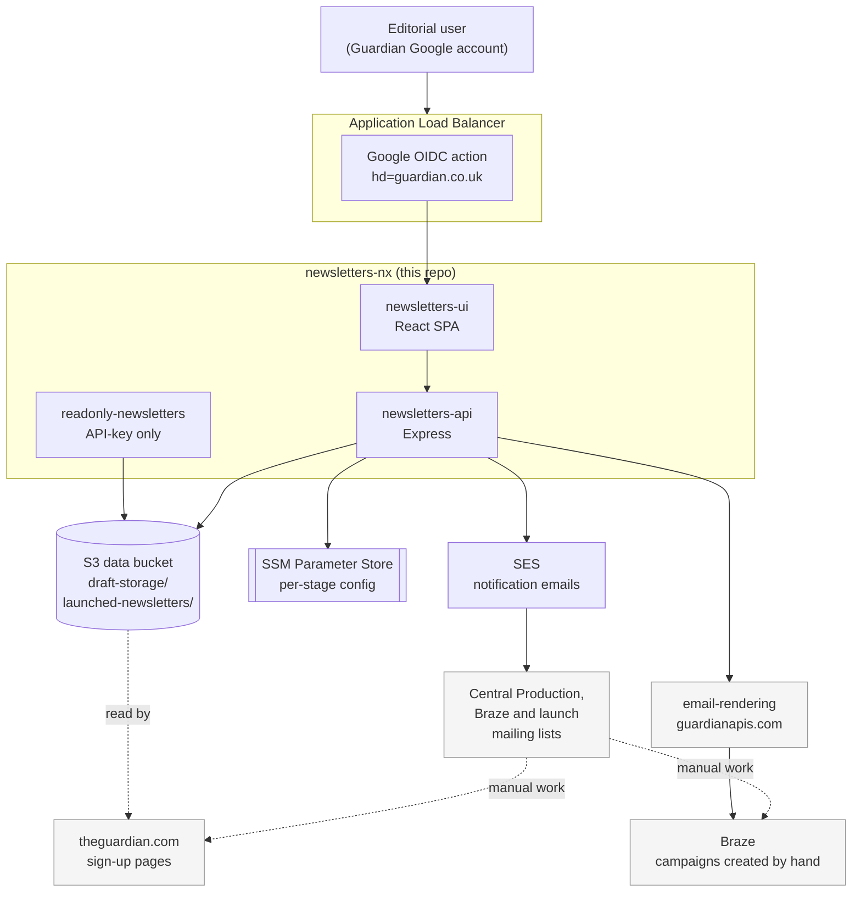
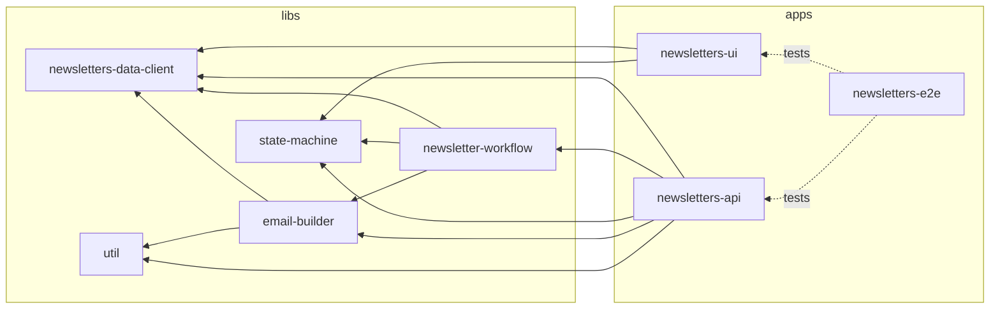

# Newsletters architecture

How `newsletters-nx` relates to the other Guardian systems involved in editorial newsletters, and how the monorepo is laid out.

For the individual subsystems, see the [documentation index](./README.md).

## System overview

The important thing the diagram shows: **newsletters-nx does not create Braze campaigns, tags or sign-up pages.** It stores newsletter data and sends emails asking people to do those things. See [Launch flow](./launch-flow.md).

For how email-rendering itself works, see [its architecture doc](https://github.com/guardian/email-rendering/blob/main/docs/architecture.md) rather than anything restated here.

## Monorepo map

[pnpm workspaces](https://pnpm.io/workspaces), three apps and five libs.

| Package                                                           | Role                                                                                                                              |
| ----------------------------------------------------------------- | --------------------------------------------------------------------------------------------------------------------------------- |
| [`apps/newsletters-api`](../apps/newsletters-api)                 | Express server. Owns storage, auth, permissions, and all routes. Also serves the UI bundle unless `NEWSLETTERS_UI_SERVE='false'`. |
| [`apps/newsletters-ui`](../apps/newsletters-ui)                   | React SPA, react-router. Renders wizards generically from step layouts.                                                           |
| [`apps/newsletters-e2e`](../apps/newsletters-e2e)                 | Playwright tests. See its [README](../apps/newsletters-e2e/README.md).                                                            |
| [`libs/newsletters-data-client`](../libs/newsletters-data-client) | Zod schemas, storage implementations, `DraftService` / `LaunchService`, derived-field generators. The core of the repo.           |
| [`libs/state-machine`](../libs/state-machine)                     | Generic wizard engine — types plus a request handler. Knows nothing about newsletters.                                            |
| [`libs/newsletter-workflow`](../libs/newsletter-workflow)         | The newsletter-specific wizard definitions built on `state-machine`.                                                              |
| [`libs/email-builder`](../libs/email-builder)                     | Notification emails authored as React components, rendered to static markup.                                                      |
| [`libs/util`](../libs/util)                                       | Shared helpers, notably the cached SSM config reader.                                                                             |

Dependencies run one way: apps depend on libs, and within libs `newsletter-workflow` and `email-builder` depend on `newsletters-data-client` and `state-machine`. Nothing in libs depends on an app.

> **Note:** changes to `newsletters-data-client` can affect PROD data consumed by other Guardian applications. See the [warning in its README](../libs/newsletters-data-client/README.md) before merging.

## External services

Everything this repo talks to, and why:

| Service                 | Used for                                                                                                                                                                                   |
| ----------------------- | ------------------------------------------------------------------------------------------------------------------------------------------------------------------------------------------ |
| **S3**                  | Draft and launched newsletter data, and layouts, in one per-stage bucket                                                                                                                   |
| **SSM Parameter Store** | At runtime: `userPermissions`, `emailRecipientConfiguration`, `imageSalt`. At CDK synth/deploy time: `s3BucketName`, `googleClientId`, `readOnlyEndpointApiKey`, `enableEmailService`      |
| **SES**                 | The five notification emails                                                                                                                                                               |
| **Secrets Manager**     | Google OAuth client secret (CDK only)                                                                                                                                                      |
| **email-rendering**     | `https://email-rendering.guardianapis.com` — template list and newsletter previews, via `fetch` in `routes/rendering-templates.ts`. Override locally with `USE_LOCAL_EMAIL_RENDERING=true` |
| **theguardian.com**     | Referenced in generated sign-up URLs only; no calls are made                                                                                                                               |
| **Braze**               | No integration. Campaigns are created manually; Braze pulls content from email-rendering                                                                                                   |

Those are the only three `@aws-sdk/client-*` packages in use across `apps/`, `libs/` and `cdk/`, and email-rendering is the only non-AWS host called at runtime.

---

Part of the [newsletters-nx documentation](./README.md).
