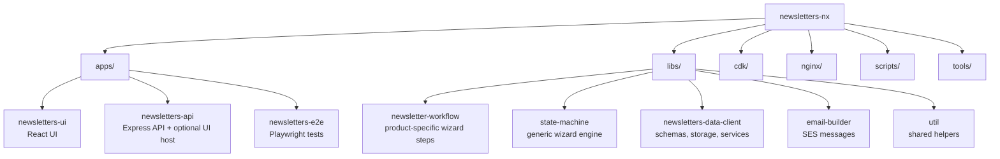
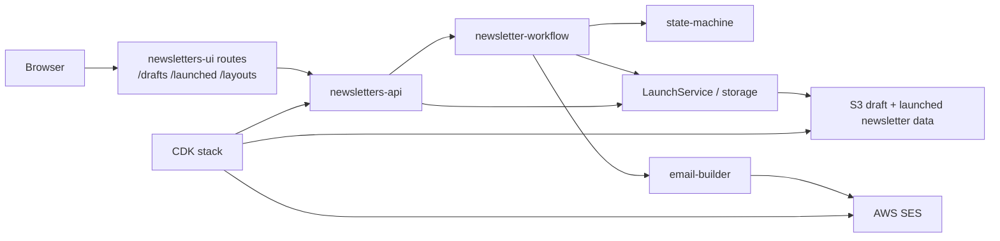

# Architecture

## Monorepo map and boundaries

- `apps/newsletters-ui` defines the main browser routes in [`apps/newsletters-ui/src/main.tsx`](../apps/newsletters-ui/src/main.tsx), with separate route trees for [`/drafts`](../apps/newsletters-ui/src/app/routes/drafts.tsx) and [`/launched`](../apps/newsletters-ui/src/app/routes/launched.tsx).
- `apps/newsletters-api` is the runtime entrypoint in [`apps/newsletters-api/src/main.ts`](../apps/newsletters-api/src/main.ts). It conditionally serves UI assets, read-only endpoints, and read/write endpoints using deployment flags from [`apps/newsletters-api/src/apiDeploymentSettings.ts`](../apps/newsletters-api/src/apiDeploymentSettings.ts).
- `libs/newsletter-workflow` holds product-specific wizard steps, including the launch flow under [`libs/newsletter-workflow/src/lib/steps/launchNewsletter/`](../libs/newsletter-workflow/src/lib/steps/launchNewsletter).
- `libs/state-machine` is the generic wizard engine used by the API route and UI wizard containers, as described in [`libs/state-machine/README.md`](../libs/state-machine/README.md).
- `libs/newsletters-data-client` owns the shared schemas, defaulting/validation logic, and storage service classes used by both draft and launched newsletter flows ([`libs/newsletters-data-client/src/lib/schemas/newsletter-data-type.ts`](../libs/newsletters-data-client/src/lib/schemas/newsletter-data-type.ts), [`libs/newsletters-data-client/src/lib/launch-service/index.ts`](../libs/newsletters-data-client/src/lib/launch-service/index.ts)).
- `libs/email-builder` builds SES-backed operational emails used during draft creation and launch requests ([`libs/email-builder/src/lib/service.ts`](../libs/email-builder/src/lib/service.ts)).
- `cdk/` defines AWS infrastructure and instance bootstrapping for CODE and PROD ([`cdk/bin/cdk.ts`](../cdk/bin/cdk.ts), [`cdk/lib/newsletters-tool.ts`](../cdk/lib/newsletters-tool.ts)).
- `nginx/` and [`scripts/setup.sh`](../scripts/setup.sh) exist only for local developer setup, mapping the local hostname in [`nginx/nginx-mapping.yml`](../nginx/nginx-mapping.yml).
- `tools/` contains maintenance scripts such as [`tools/scripts/fetch-sample-data-fixtures.sh`](../tools/scripts/fetch-sample-data-fixtures.sh), which refreshes fixture data used to protect schema changes.

## Runtime responsibilities

### UI

- The UI is a React app with separate draft and launched newsletter views. `draftRoute` mounts the creation/edit/launch wizards, while `launchedRoute` mounts launched newsletter list, detail, edit, rendering-options, JSON edit, and preview views ([`apps/newsletters-ui/src/app/routes/drafts.tsx`](../apps/newsletters-ui/src/app/routes/drafts.tsx), [`apps/newsletters-ui/src/app/routes/launched.tsx`](../apps/newsletters-ui/src/app/routes/launched.tsx)).
- Wizard requests are posted to `POST /api/currentstep` via [`apps/newsletters-ui/src/app/api-requests/make-wizard-step-request.ts`](../apps/newsletters-ui/src/app/api-requests/make-wizard-step-request.ts).

### API

- The API registers health, draft, layout, newsletter, user, notification, and wizard endpoints from one Express process ([`apps/newsletters-api/src/main.ts`](../apps/newsletters-api/src/main.ts)).
- In default local and read/write deployments, the API also serves the built UI bundle and SPA routes through [`apps/newsletters-api/src/register-ui-server.ts`](../apps/newsletters-api/src/register-ui-server.ts).

### Workflow and state machine

- `POST /api/currentstep` selects a layout from `newslettersWorkflowStepLayout`, checks permissions, and delegates button execution and validation to the shared state machine ([`apps/newsletters-api/src/app/routes/currentStep.ts`](../apps/newsletters-api/src/app/routes/currentStep.ts)).
- Launch-specific button execution lives in [`libs/newsletter-workflow/src/lib/executeLaunch.ts`](../libs/newsletter-workflow/src/lib/executeLaunch.ts), while reusable wizard orchestration lives in `libs/state-machine`.

### Data and integrations

- Storage switches between in-memory fixtures for local/CI use and S3-backed stores for deployed environments ([`apps/newsletters-api/src/services/storage/index.ts`](../apps/newsletters-api/src/services/storage/index.ts)).
- Launched newsletters are stored separately from drafts; the S3-backed launched newsletter store uses the `launched-newsletters/` prefix ([`libs/newsletters-data-client/src/lib/newsletter-storage/s3-newsletter-storage.ts`](../libs/newsletters-data-client/src/lib/newsletter-storage/s3-newsletter-storage.ts)).
- Launch and notification flows send SES emails through `libs/email-builder`, using environment wiring from [`apps/newsletters-api/src/services/notifications/email-env.ts`](../apps/newsletters-api/src/services/notifications/email-env.ts) and [`apps/newsletters-api/src/services/notifications/email-service.ts`](../apps/newsletters-api/src/services/notifications/email-service.ts).
- Deployed tool access is fronted by Google OIDC on the load balancer, while per-user capabilities come from local config or SSM-backed permission data ([`cdk/lib/newsletters-tool.ts`](../cdk/lib/newsletters-tool.ts), [`apps/newsletters-api/src/services/permissions/index.ts`](../apps/newsletters-api/src/services/permissions/index.ts), [`apps/newsletters-api/src/services/permissions/ParamPermissions.ts`](../apps/newsletters-api/src/services/permissions/ParamPermissions.ts)).

## WIP and temporary edges

- **WIP: Stand redesign flow.** The UI still carries an alternate wizard container behind the `switch-stand` feature flag, which defaults to `false` in [`apps/newsletters-ui/src/app/featureSwitches.ts`](../apps/newsletters-ui/src/app/featureSwitches.ts). Remove this note once the flag is deleted or the redesign path becomes the only supported flow.
