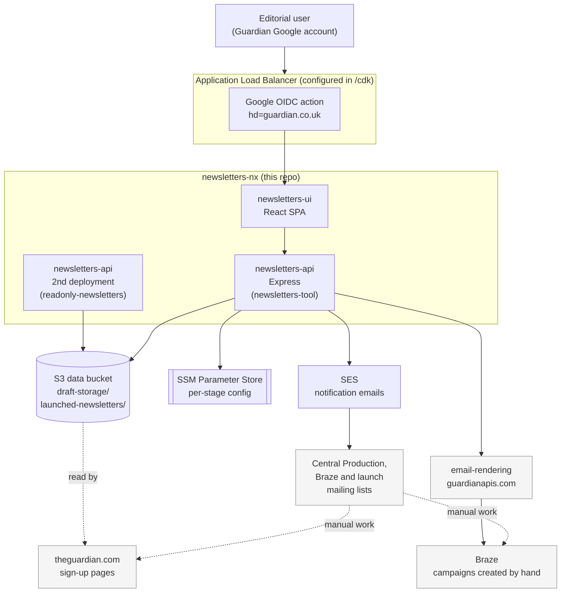

# Newsletters architecture

How `newsletters-nx` fits into Guardian’s editorial newsletter ecosystem, and how this monorepo is structured.

## System overview

### Key boundaries

`newsletters-nx` **does not** create Braze campaigns, tags, or sign-up pages directly.  
It stores newsletter data and sends notification emails to people/teams who complete those manual steps.

`readonly-newsletters` is **not a separate application**. It is the same
`newsletters-api` code deployed a second time with the UI and write routes
switched off (`NEWSLETTERS_API_READ=true`, `NEWSLETTERS_UI_SERVE=false`), gated
by an `X-Gu-API-Key` header instead of Google auth so trusted Guardian services
can read launched newsletter data without needing Google user credentials.

For launch details, see [Launch flow](./launch-flow.md).  
For email-rendering internals, see [email-rendering architecture](https://github.com/guardian/email-rendering/blob/main/docs/architecture.md).

### Packages and responsibilities

| Package                                                           | Responsibility                                                                                       | README                                         |
| ----------------------------------------------------------------- | ---------------------------------------------------------------------------------------------------- | ---------------------------------------------- |
| [`apps/newsletters-api`](../apps/newsletters-api)                 | Main backend API: storage, auth/authorisation, workflow routes, and (normally) serving the UI bundle | [↗](../apps/newsletters-api/README.md)         |
| [`apps/newsletters-ui`](../apps/newsletters-ui)                   | React SPA for creating, editing, launching, and managing newsletters                                 | —                                              |
| [`apps/newsletters-e2e`](../apps/newsletters-e2e)                 | Playwright end-to-end tests                                                                          | [↗](../apps/newsletters-e2e/README.md)         |
| [`libs/newsletters-data-client`](../libs/newsletters-data-client) | Core newsletter schemas, data services, storage abstractions, and derived fields                     | [↗](../libs/newsletters-data-client/README.md) |
| [`libs/state-machine`](../libs/state-machine)                     | Generic wizard/state-machine engine                                                                  | [↗](../libs/state-machine/README.md)           |
| [`libs/newsletter-workflow`](../libs/newsletter-workflow)         | Newsletter-specific wizard definitions and launch workflow                                           | [↗](../libs/newsletter-workflow/README.md)     |
| [`libs/email-builder`](../libs/email-builder)                     | Notification email content and rendering                                                             | [↗](../libs/email-builder/README.md)           |
| [`libs/util`](../libs/util)                                       | Shared utilities (including runtime config helpers)                                                  | [↗](../libs/util/README.md)                    |
| [`cdk`](../cdk)                                                   | AWS infrastructure definitions                                                                       | [↗](../cdk/README.md)                          |

### Dependency direction

Dependencies are one-way:

- apps depend on libs
- libs do not depend on apps

## External services

| Service                 | Used for                                                                                                     |
| ----------------------- |--------------------------------------------------------------------------------------------------------------|
| **[AWS S3](https://aws.amazon.com/s3/)** | Persistent storage for draft and launched newsletter data                                                    |
| **[AWS Systems Manager Parameter Store](https://docs.aws.amazon.com/systems-manager/latest/userguide/systems-manager-parameter-store.html)** | Per-stage runtime configuration (permissions, recipients, feature/config values)                             |
| **[AWS SES](https://aws.amazon.com/ses/)** | Sending notification emails for draft/launch/Braze/Central Production workflows (not newsletters themselves) |
| **[AWS Secrets Manager](https://aws.amazon.com/secrets-manager/)** | OIDC client secret and other deployment-time secrets                                                         |
| **[email-rendering](https://github.com/guardian/email-rendering)** | Template discovery and newsletter preview/rendering                                                          |
| **[frontend](https://github.com/guardian/frontend)** | Calls `/api/newsletters` and `/api/layouts` to fetch newsletter data for sign-up embeds, the email-newsletters index page, and edition layout pages |
| **[dotcom-rendering](https://github.com/guardian/dotcom-rendering)** | Renders sign-up pages and in-article sign-up blocks using data passed through from `frontend` (no direct API call to this repo) |
| **[Braze](https://dashboard-01.braze.eu/dashboard/app_usage/5b75934336dc781764d855ae?locale=en)** | Consumes newsletter content from email-rendering; sends the newsletters to readers, campaign setup is manual |
## Related docs

- [Data model](./data-model.md) — the shape of the data flowing through this system
- [Launch flow](./launch-flow.md) — the handoff from this repo to the manual downstream steps
- [Infrastructure](./infrastructure.md) — how the two API deployments are actually built
