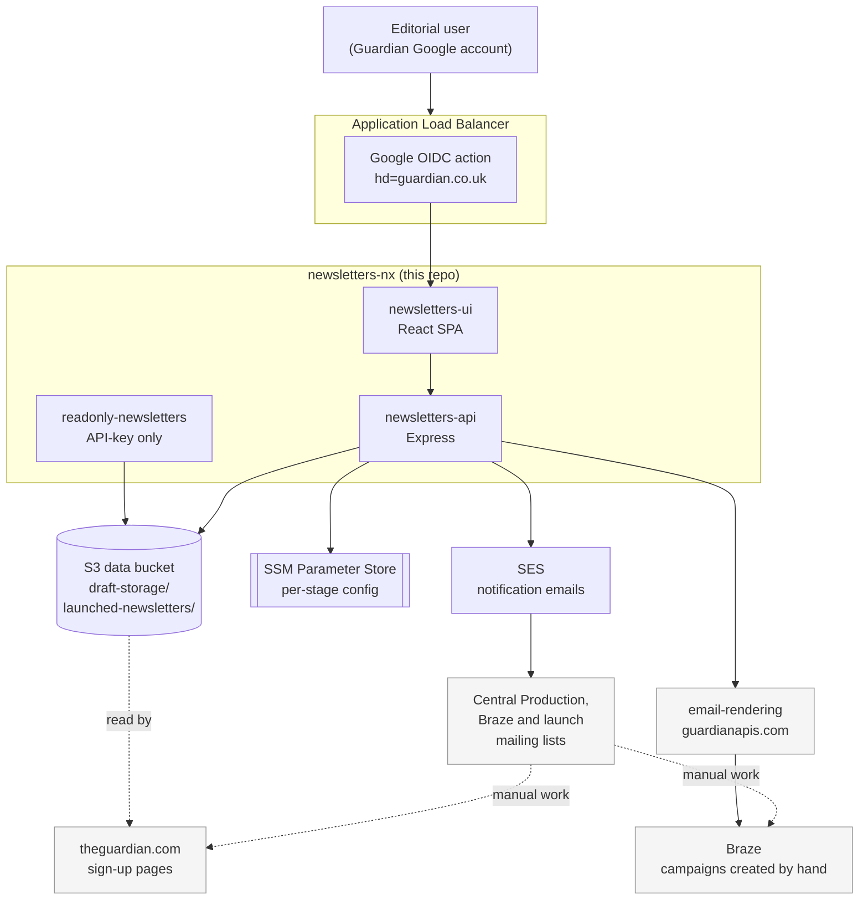

# Newsletters architecture

How `newsletters-nx` fits into Guardian’s editorial newsletter ecosystem, and how this monorepo is structured.

## System overview

### Key boundary

`newsletters-nx` **does not** create Braze campaigns, tags, or sign-up pages directly.  
It stores newsletter data and sends notification emails to people/teams who complete those manual steps.

For launch details, see [Launch flow](./launch-flow.md).  
For email-rendering internals, see [email-rendering architecture](https://github.com/guardian/email-rendering/blob/main/docs/architecture.md).

### Packages and responsibilities

| Package | Responsibility |
| --- | --- |
| [`apps/newsletters-api`](../apps/newsletters-api) | Main backend API: storage, auth/authorisation, workflow routes, and (normally) serving the UI bundle |
| [`apps/newsletters-ui`](../apps/newsletters-ui) | React SPA for creating, editing, launching, and managing newsletters |
| [`apps/newsletters-e2e`](../apps/newsletters-e2e) | Playwright end-to-end tests |
| [`libs/newsletters-data-client`](../libs/newsletters-data-client) | Core newsletter schemas, data services, storage abstractions, and derived fields |
| [`libs/state-machine`](../libs/state-machine) | Generic wizard/state-machine engine |
| [`libs/newsletter-workflow`](../libs/newsletter-workflow) | Newsletter-specific wizard definitions and launch workflow |
| [`libs/email-builder`](../libs/email-builder) | Notification email content and rendering |
| [`libs/util`](../libs/util) | Shared utilities (including runtime config helpers) |

### Dependency direction

Dependencies are one-way:
- apps depend on libs
- libs do not depend on apps

Within libs, `newsletter-workflow` composes `state-machine` and `newsletters-data-client`.

## External services

| Service | Used for |
| --- | --- |
| **S3** | Persistent storage for draft and launched newsletter data |
| **SSM Parameter Store** | Per-stage runtime configuration (permissions, recipients, feature/config values) |
| **SES** | Sending notification emails for draft/launch/Braze/Central Production workflows |
| **Secrets Manager** | OIDC client secret and other deployment-time secrets |
| **email-rendering** | Template discovery and newsletter preview/rendering |
| **theguardian.com** | Consumes launched data for sign-up page usage (no direct API integration from this repo) |
| **Braze** | Consumes rendered newsletter content; campaign setup is manual |

## Related docs

- [Data model](./data-model.md)
- [Launch flow](./launch-flow.md)
- [Auth and permissions](./auth-and-permissions.md)
- [Deployment](./deployment.md)
