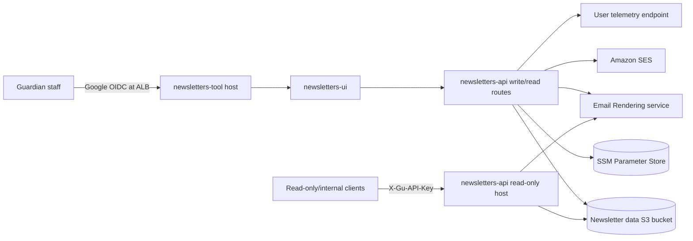
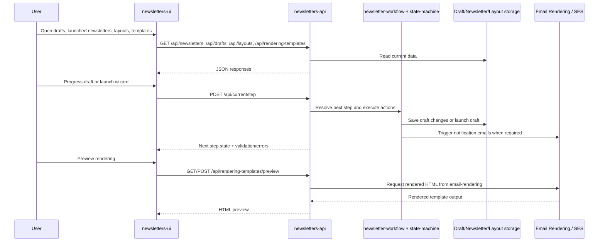

# Architecture overview

## What is in this repository?

The monorepo contains three deployable applications plus shared libraries:

| Area | Purpose | Key files |
| --- | --- | --- |
| [`apps/newsletters-ui`](../../apps/newsletters-ui) | React UI for viewing launched newsletters, managing drafts, editing rendering options, and maintaining layouts. | [`src/main.tsx`](../../apps/newsletters-ui/src/main.tsx), [`src/app/routes`](../../apps/newsletters-ui/src/app/routes) |
| [`apps/newsletters-api`](../../apps/newsletters-api) | Express API that serves newsletter, draft, layout, user, rendering-preview, and wizard-step endpoints. In some deployments it also serves the UI bundle. | [`src/main.ts`](../../apps/newsletters-api/src/main.ts), [`src/app/routes`](../../apps/newsletters-api/src/app/routes) |
| [`apps/newsletters-e2e`](../../apps/newsletters-e2e) | Playwright end-to-end tests covering UI journeys and API access. | [`src/ui`](../../apps/newsletters-e2e/src/ui), [`src/api`](../../apps/newsletters-e2e/src/api) |
| [`libs/newsletter-workflow`](../../libs/newsletter-workflow) | Newsletter-specific wizard definitions for draft setup, rendering options, and launch. | [`src/lib/newsletter-workflow.ts`](../../libs/newsletter-workflow/src/lib/newsletter-workflow.ts) |
| [`libs/state-machine`](../../libs/state-machine) | Generic wizard/state-machine engine used by the draft and launch flows. | [`src/lib/handleWizardRequest.ts`](../../libs/state-machine/src/lib/handleWizardRequest.ts) |
| [`libs/newsletters-data-client`](../../libs/newsletters-data-client) | Shared schemas, storage abstractions, derived-field helpers, and transformations including legacy API compatibility. | [`src/lib/schemas`](../../libs/newsletters-data-client/src/lib/schemas), [`src/lib/launch-service/index.ts`](../../libs/newsletters-data-client/src/lib/launch-service/index.ts) |
| [`libs/email-builder`](../../libs/email-builder) | Builds SES emails for new-draft, launch, Braze, and Central Production notifications. | [`src/lib/service.ts`](../../libs/email-builder/src/lib/service.ts) |
| [`libs/util`](../../libs/util) | Shared AWS Parameter Store configuration helpers. | [`src/lib/config-service.ts`](../../libs/util/src/lib/config-service.ts) |
| [`cdk`](../../cdk) | AWS infrastructure for the tool, read-only API host, S3 storage, SES identity, and load balancer auth/routing. | [`lib/newsletters-tool.ts`](../../cdk/lib/newsletters-tool.ts) |

## High-level deployment

### Notes

- The CDK stack creates two public Node applications in [`cdk/lib/newsletters-tool.ts`](../../cdk/lib/newsletters-tool.ts):
  - **`newsletters-tool`**: UI plus read/write API, fronted by Google authentication.
  - **`newsletters-api`**: read-only API host protected by an `X-Gu-API-Key` listener rule.
- Newsletter and layout data is persisted in S3 outside local development; local development can swap to in-memory storage via [`apps/newsletters-api/src/apiDeploymentSettings.ts`](../../apps/newsletters-api/src/apiDeploymentSettings.ts).
- User permissions and operational settings are read from AWS Parameter Store.
- The repository root README already includes a lower-level email-rendering diagram; this page shows where that service sits in the broader system rather than duplicating it.

## Request and workflow flow

## Key runtime boundaries

### UI routing

The main UI routes are registered in [`apps/newsletters-ui/src/main.tsx`](../../apps/newsletters-ui/src/main.tsx):

- `/` dashboard and email template list
- `/drafts` draft list, detail view, setup wizards, and launch wizard
- `/launched` launched newsletter list, detail, edit, rendering options, and preview
- `/layouts` edition layout map and editor

### API routing

The API enables or disables route groups in [`apps/newsletters-api/src/main.ts`](../../apps/newsletters-api/src/main.ts):

- read routes: newsletters, drafts, layouts, rendering templates
- read/write routes: current-step wizard endpoint, user profile/permissions, newsletter updates, notifications, layout writes

### Storage model

- **Drafts** remain partial records until they can satisfy launch requirements.
- **Launched newsletters** use the stricter `newsletterDataSchema`.
- Launching a draft copies it into launched newsletter storage and then deletes the draft in [`libs/newsletters-data-client/src/lib/launch-service/index.ts`](../../libs/newsletters-data-client/src/lib/launch-service/index.ts).

### Compatibility paths

- [`apps/newsletters-api/src/app/routes/newsletters.ts`](../../apps/newsletters-api/src/app/routes/newsletters.ts) still exposes `/api/legacy/newsletters`.
- [`libs/newsletters-data-client/src/lib/schemas/data-collection-schema.ts`](../../libs/newsletters-data-client/src/lib/schemas/data-collection-schema.ts) keeps `article-based-legacy` valid in stored data but removes it from new-draft UI choices.
- [`apps/newsletters-ui/src/app/routes/drafts.tsx`](../../apps/newsletters-ui/src/app/routes/drafts.tsx) can still serve either the older wizard UI or the newer Stand redesign, depending on `switch-stand`.
