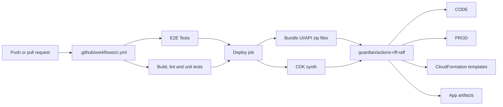
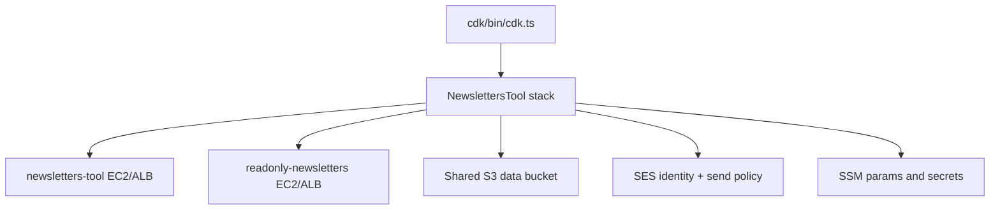

# Deployment

## Delivery path

- CI runs on both `pull_request` and `push` to `main` in [`.github/workflows/ci.yml`](../.github/workflows/ci.yml).
- The workflow has three main jobs:
  - `E2E Tests` boots the API with in-memory storage and runs Playwright.
  - `Build, lint and unit tests` runs root lint/test plus CDK lint/test/synth.
  - `Build, test and deploy to riff-raff` re-runs workspace checks, bundles the UI/API, synthesizes CDK, and uploads artifacts to RiffRaff.
- The deploy job uploads three artifact groups via `guardian/actions-riff-raff`:
  - `newsletters-tool-cfn`
  - `newsletters-tool`
  - `newsletters-api`

Those group names must stay aligned with [`riff-raff.yaml`](../riff-raff.yaml).

## Environment model

- RiffRaff only allows `CODE` and `PROD` for this repo ([`riff-raff.yaml`](../riff-raff.yaml)).
- CDK synthesizes one stack per environment in [`cdk/bin/cdk.ts`](../cdk/bin/cdk.ts):
  - `NewslettersTool-CODE`
  - `NewslettersTool-PROD`
- The tool and read-only API have separate public domains in each stage, also defined in [`cdk/bin/cdk.ts`](../cdk/bin/cdk.ts).
- The CDK stack builds two `GuNodeApp` instances in [`cdk/lib/newsletters-tool.ts`](../cdk/lib/newsletters-tool.ts):
  - `newsletters-tool` serves the write-capable tool with Google-authenticated access
  - `newsletters-api` serves the read-only API and blocks requests that do not carry the required `X-Gu-API-Key` header

## Deployment mechanics

- `riff-raff.yaml` deploys CloudFormation first (`newsletters-tool-cfn`) and then the two autoscaling app deployments that depend on it.
- The EC2 user-data in [`cdk/lib/newsletters-tool.ts`](../cdk/lib/newsletters-tool.ts) downloads the uploaded zip from the Guardian distribution bucket, unpacks it under `/opt/<app>`, and starts the `newsletters-api` systemd unit.
- Runtime behavior is toggled with environment variables consumed by [`apps/newsletters-api/src/apiDeploymentSettings.ts`](../apps/newsletters-api/src/apiDeploymentSettings.ts):
  - `NEWSLETTERS_API_READ`
  - `NEWSLETTERS_API_READ_WRITE`
  - `NEWSLETTERS_UI_SERVE`
  - `USE_IN_MEMORY_STORAGE`
  - `ENABLE_DYNAMIC_IMAGE_SIGNING`
  - `ENABLE_EMAIL_SERVICE`
- The stack also provisions the shared S3 data bucket, SES identity/policy, Google OIDC wiring, and SSM-backed configuration such as user permissions and API keys ([`cdk/lib/newsletters-tool.ts`](../cdk/lib/newsletters-tool.ts)).

## Troubleshooting and investigation

- Start with the relevant GitHub Actions run:
  - check the `E2E Tests` job for Playwright failures
  - check the `Build, lint and unit tests` job for workspace or CDK failures
  - download the uploaded Playwright artifact if a browser-level failure needs inspection
- To reproduce CI locally, use the same local-storage flags shown in [`.github/workflows/ci.yml`](../.github/workflows/ci.yml), especially `USE_IN_MEMORY_STORAGE='true'`, `USE_DEVELOPER_PROFILE='true'`, and `USE_LOCAL_USER_PERMISSIONS='true'`.
- If the deployed app starts but behaves incorrectly, inspect the deployment flags in [`apps/newsletters-api/src/apiDeploymentSettings.ts`](../apps/newsletters-api/src/apiDeploymentSettings.ts) and the instance bootstrapping in [`cdk/lib/newsletters-tool.ts`](../cdk/lib/newsletters-tool.ts).
- If only the read-only API is failing, verify the listener rule that gates access with `X-Gu-API-Key` in [`cdk/lib/newsletters-tool.ts`](../cdk/lib/newsletters-tool.ts).
- If a schema change appears to “remove” newsletters from API responses, investigate [`libs/newsletters-data-client/README.md`](../libs/newsletters-data-client/README.md) and the schema tests before assuming a deployment regression.

## Rollback pointers

- RiffRaff is the rollback boundary because both the CloudFormation templates and app zips are uploaded there from CI ([`.github/workflows/ci.yml`](../.github/workflows/ci.yml), [`riff-raff.yaml`](../riff-raff.yaml)).
- Roll back by redeploying the previous known-good artifact set for `newsletters-tool-cfn`, `newsletters-tool`, and `newsletters-api`, or by reverting the source change and letting CI upload a replacement set.
- If the failure is infrastructure-only, re-run `npm --prefix cdk run synth` and inspect the generated template diff before promoting another deployment.
