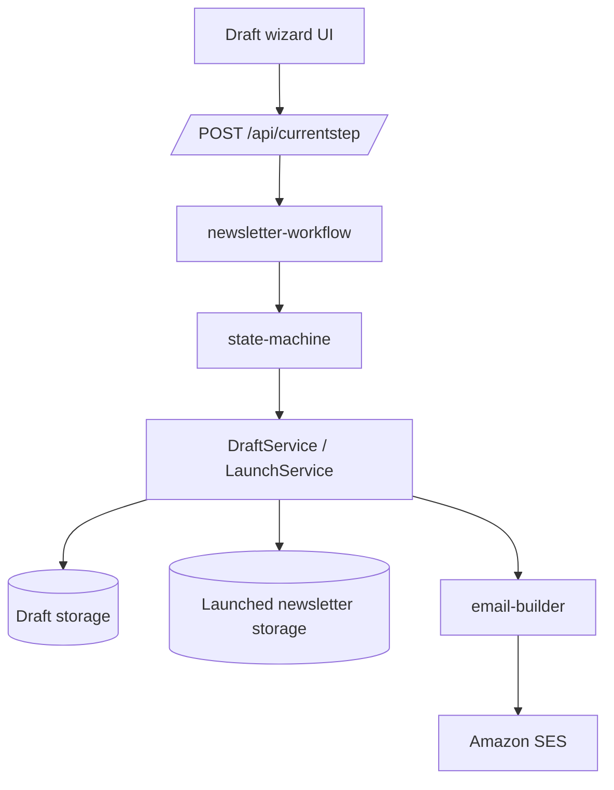

# Drafting and launch workflows

## What this feature does

Draft workflows let editors define newsletter metadata before it is published to the launched newsletter collection. The tool stores incomplete work as drafts, shows how complete a draft is, and guides the user through a launch review before creating the launched newsletter record.

## Current flow to focus on

The newer draft setup flow is the Stand-based wizard selected by `?switch-stand=true` in [`apps/newsletters-ui/src/app/routes/drafts.tsx`](../../apps/newsletters-ui/src/app/routes/drafts.tsx). It is backed by the `NEWSLETTER_DATA_STAND_REDESIGN` layout in [`libs/newsletter-workflow/src/lib/steps/standRedesignNewsletterData`](../../libs/newsletter-workflow/src/lib/steps/standRedesignNewsletterData).

The older wizard is still present as a fallback and still has tests, but this page treats it as legacy.

## User journey

### 1. Create or open a draft

Users enter via:

- the dashboard “Create newsletter” button in [`HomeMenu.tsx`](../../apps/newsletters-ui/src/app/components/HomeMenu.tsx)
- the “New draft” button in [`DraftListView.tsx`](../../apps/newsletters-ui/src/app/components/views/DraftListView.tsx)
- the draft list at `/drafts`

The draft list:

- fetches `/api/drafts`
- filters/searches rows client-side
- shows progress using `calculateProgress`
- exposes edit, delete, and launch actions based on permissions

Key files:

- [`apps/newsletters-ui/src/app/components/DraftsTable.tsx`](../../apps/newsletters-ui/src/app/components/DraftsTable.tsx)
- [`apps/newsletters-ui/src/app/components/DraftDetails.tsx`](../../apps/newsletters-ui/src/app/components/DraftDetails.tsx)
- [`apps/newsletters-api/src/app/routes/drafts.ts`](../../apps/newsletters-api/src/app/routes/drafts.ts)

### 2. Fill in the setup wizard

The redesigned wizard breaks setup into these steps:

1. Introduction
2. Name and frequency
3. Production details
4. Launch / promotion details
5. Targeting
6. Tags
7. Promotion copy and images
8. Review
9. Finish / hand-off to launch wizard

Those steps are defined in [`standRedesignLayout`](../../libs/newsletter-workflow/src/lib/steps/standRedesignNewsletterData/index.ts).

Important behaviour:

- newsletter names generate identity/Braze/Ophan defaults via [`derive-newsletter-fields.ts`](../../libs/newsletters-data-client/src/lib/derive-newsletter-fields.ts)
- `article-based-legacy` is not offered for new drafts, even though stored legacy data is still accepted
- article-based drafts are expected to complete rendering options before launch
- the wizard supports skip navigation on steps marked skippable by the state-machine

### 3. Review readiness

Draft detail pages show missing launch requirements using Zod validation in [`getDraftNotReadyIssues`](../../libs/newsletters-data-client/src/lib/draft-to-newsletter.ts). This is the same completeness logic that powers the progress indicator in the drafts table.

### 4. Launch review and launch request

The launch wizard is a separate flow (`LAUNCH_NEWSLETTER`) defined in [`libs/newsletter-workflow/src/lib/steps/launchNewsletter`](../../libs/newsletter-workflow/src/lib/steps/launchNewsletter).

It guides the user through:

- checking whether required data is present
- confirming or editing identity/Braze values
- requesting launch

Launching a draft:

1. reads the draft from draft storage
2. applies defaults and derived fields
3. creates the launched newsletter record
4. deletes the draft
5. asynchronously sends setup emails and updates creation-status fields

Key files:

- [`libs/newsletters-data-client/src/lib/launch-service/index.ts`](../../libs/newsletters-data-client/src/lib/launch-service/index.ts)
- [`libs/newsletter-workflow/src/lib/executeLaunch.ts`](../../libs/newsletter-workflow/src/lib/executeLaunch.ts)
- [`apps/newsletters-api/src/app/routes/currentStep.ts`](../../apps/newsletters-api/src/app/routes/currentStep.ts)

## Data flow

## Legacy and migration notes

- The older MUI-based draft wizard still exists in [`libs/newsletter-workflow/src/lib/steps/newsletterData`](../../libs/newsletter-workflow/src/lib/steps/newsletterData) and is used when the Stand switch is off.
- The redesigned flow adds an explicit review step and a “Go to launch wizard” finish action.
- Both old and new flows currently coexist in code and Playwright coverage.
