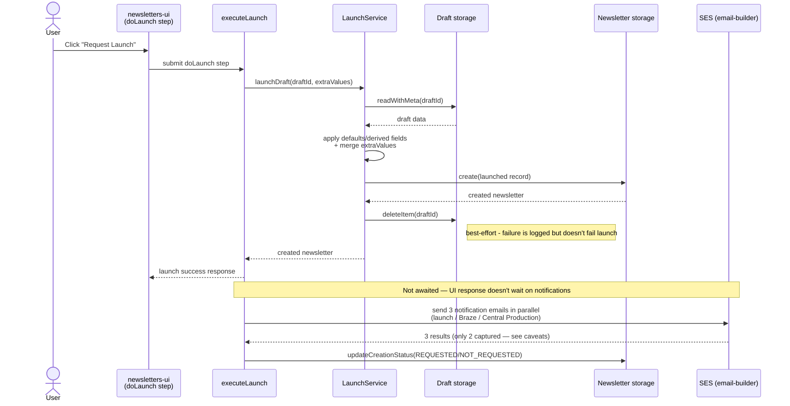

# Launch flow

What happens when a draft newsletter is launched, and what launch statuses mean.

## Overview

When a user launches a newsletter, the workflow does four things:

1. Creates a launched newsletter record from the draft
2. Attempts to remove the draft
3. Sends notification emails for downstream/manual setup steps
4. Sets creation status fields based on notification outcomes

This flow is initiated by the launch wizard (`doLaunch` step) and executed server-side.

## Sequence

## Status semantics (important)

`REQUESTED` means automated emails to editorial and production teams are sent.

- Braze campaign setup is manual
- Tag and sign-up page setup are manual

## Known caveats

- Status values reflect this system's request path, not guaranteed downstream completion.
- If email sending is disabled by environment/config (`ENABLE_EMAIL_SERVICE`), status behaviour may still indicate request success from the app's perspective.
- Notification results are mislabelled (see https://github.com/guardian/newsletters-nx/issues/727)

## Post-launch Braze update requests

After launch, Braze-related fields can be updated and a separate Braze update
notification can be requested via `GET /api/email/:newsletterId/brazeUpdate`.
This is a distinct path from the initial launch notification set.
