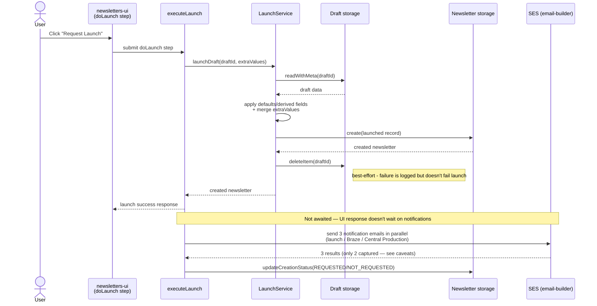

# Launch flow

What happens when a draft newsletter is launched, and what launch statuses mean.

## Overview

When a user launches a newsletter, the workflow does four things:

1. Creates a launched newsletter record from the draft
2. Attempts to remove the draft
3. Sends notification emails for downstream/manual setup steps
4. Sets creation status fields based on notification outcomes

This flow is initiated by the launch wizard (`doLaunch` step) and executed server-side.

## Sequence

## Step-by-step behaviour

### 1) Create launched record

The launch service reads the draft, applies defaults/derived values, merges user-edited launch values, and writes the launched record to launched storage.

### 2) Delete draft

After a successful launch write, the draft is deleted on a best-effort basis.  
If deletion fails, launch still succeeds (with warning/logging).

### 3) Send notifications

Launch triggers notification emails (for example launch/Braze/Central Production handoffs).  
These notifications represent requests to downstream teams, not direct provisioning by this system.

### 4) Set status fields

`*CreationStatus` fields are set from notification results (e.g. `REQUESTED`/`NOT_REQUESTED` semantics in current implementation).

## Status semantics (important)

`REQUESTED` means a request/handoff notification was issued successfully by this system.  
It does **not** mean downstream work has been completed.

In particular:

- Braze campaign setup is manual
- Tag and sign-up page setup are manual
- `newsletters-nx` does not directly create those downstream entities

## Known caveats

- Status values reflect this system's request path, not guaranteed downstream completion.
- If email sending is disabled by environment/config (`ENABLE_EMAIL_SERVICE`), status behaviour may still indicate request success from the app's perspective.
- **Notification results are mislabelled.** In
  [`executeLaunch.ts`](../libs/newsletter-workflow/src/lib/executeLaunch.ts)
  three emails are sent via `Promise.all`, but the result array is destructured
  into only two variables:

    | Email sent                                        | Result is assigned to                                  |
    | ------------------------------------------------- | ------------------------------------------------------ |
    | `NEWSLETTER_LAUNCH`                               | `brazeCampaignCreationStatus`                          |
    | `BRAZE_SET_UP_REQUEST`                            | `tagCreationStatus` **and** `signupPageCreationStatus` |
    | `CENTRAL_PRODUCTION_TAGS_AND_SIGNUP_PAGE_REQUEST` | discarded                                              |

    Read those three status fields with this in mind until it is fixed.

## Post-launch Braze update requests

After launch, Braze-related fields can be updated and a separate Braze update
notification can be requested via `GET /api/email/:newsletterId/brazeUpdate`.
This is a distinct path from the initial launch notification set.
