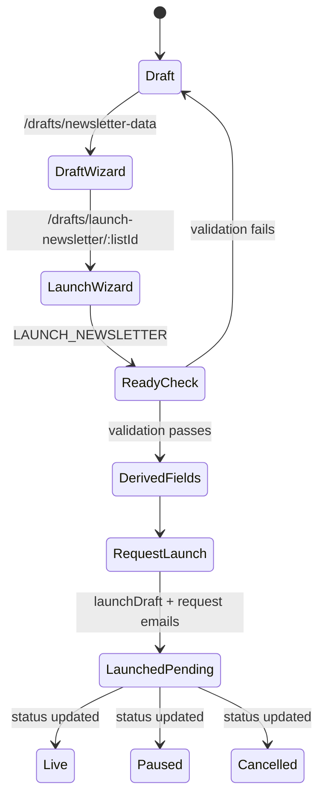
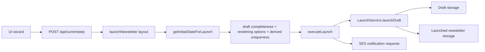

# Launch flow

## What “launch” means in this repo

“Launch” here is the newsletter publish/send handoff, not application deployment.

In the current implementation, a launch request:

1. reads a draft newsletter,
2. validates/defaults it into the launched newsletter schema,
3. creates a launched newsletter record,
4. deletes the draft when possible, and
5. requests downstream work by email for Braze, signup page/tag creation, and launch tracking.

The core code path is [`apps/newsletters-api/src/app/routes/currentStep.ts`](../apps/newsletters-api/src/app/routes/currentStep.ts) → [`libs/newsletter-workflow/src/lib/executeLaunch.ts`](../libs/newsletter-workflow/src/lib/executeLaunch.ts) → [`libs/newsletters-data-client/src/lib/launch-service/index.ts`](../libs/newsletters-data-client/src/lib/launch-service/index.ts).

## Implemented lifecycle and states

- A **draft** is intentionally partial and is validated against [`draftNewsletterDataSchema`](../libs/newsletters-data-client/src/lib/schemas/draft-newsletter-data-type.ts).
- A **launched newsletter** must satisfy the full [`newsletterDataSchema`](../libs/newsletters-data-client/src/lib/schemas/newsletter-data-type.ts).
- New launches default the launched newsletter `status` to `pending` unless a different value is already set in the draft/defaulting layer ([`libs/newsletters-data-client/src/lib/draft-to-newsletter.ts`](../libs/newsletters-data-client/src/lib/draft-to-newsletter.ts), [`libs/newsletters-data-client/src/lib/draft-to-newsletter.spec.ts`](../libs/newsletters-data-client/src/lib/draft-to-newsletter.spec.ts)).
- The launched schema currently supports `pending`, `live`, `paused`, and `cancelled` — there is no first-class `scheduled` or `sent` state in this repo today ([`libs/newsletters-data-client/src/lib/schemas/newsletter-data-type.ts`](../libs/newsletters-data-client/src/lib/schemas/newsletter-data-type.ts)).
- Downstream workflow fields track launch follow-up work separately as `NOT_REQUESTED`, `REQUESTED`, or `COMPLETED` for Braze, signup page creation, and tag creation ([`libs/newsletters-data-client/src/lib/schemas/newsletter-data-type.ts`](../libs/newsletters-data-client/src/lib/schemas/newsletter-data-type.ts)).
- The UI surfaces a launched newsletter’s overall `pending` state together with those downstream statuses in the launched table tooltip ([`apps/newsletters-ui/src/app/components/Cell.tsx`](../apps/newsletters-ui/src/app/components/Cell.tsx)).
- Legacy consumers still see `pending` as `paused` when data is transformed for the legacy endpoint, so check both models when debugging status mismatches ([`libs/newsletters-data-client/src/lib/transformDataToLegacyNewsletter.spec.ts`](../libs/newsletters-data-client/src/lib/transformDataToLegacyNewsletter.spec.ts)).

## Preconditions, validation, and guardrails

- Launch requires the `launchNewsletters` permission; otherwise `POST /api/currentstep` returns a persistent access error ([`apps/newsletters-api/src/app/routes/currentStep.ts`](../apps/newsletters-api/src/app/routes/currentStep.ts)).
- The launch wizard starts from `LAUNCH_NEWSLETTER` and loads server-side initial state via [`getInitialStateForLaunch`](../libs/newsletter-workflow/src/lib/getInitialStateForLaunch.ts).
- A draft cannot proceed if required launch fields are missing, and `article-based` drafts must also satisfy rendering option requirements ([`libs/newsletter-workflow/src/lib/steps/launchNewsletter/isDataCompleteLayout.ts`](../libs/newsletter-workflow/src/lib/steps/launchNewsletter/isDataCompleteLayout.ts), [`libs/newsletters-data-client/src/lib/draft-to-newsletter.ts`](../libs/newsletters-data-client/src/lib/draft-to-newsletter.ts)).
- Derived identifiers such as `identityName`, Braze names, and campaign fields are suffixed to avoid collisions with already launched newsletters before the final request step ([`libs/newsletter-workflow/src/lib/getInitialStateForLaunch.ts`](../libs/newsletter-workflow/src/lib/getInitialStateForLaunch.ts)).
- Storage adds another guardrail: launched newsletter creation fails if the draft still does not satisfy the full schema or if the identity clashes with an existing launched item ([`libs/newsletters-data-client/src/lib/newsletter-storage/InMemoryNewsletterStorage.ts`](../libs/newsletters-data-client/src/lib/newsletter-storage/InMemoryNewsletterStorage.ts), [`libs/newsletters-data-client/src/lib/newsletter-storage/s3-newsletter-storage.ts`](../libs/newsletters-data-client/src/lib/newsletter-storage/s3-newsletter-storage.ts)).

## What triggers publish/send?

- The UI wizard posts button transitions to [`/api/currentstep`](../apps/newsletters-ui/src/app/api-requests/make-wizard-step-request.ts).
- The `doLaunch` step binds the launch button to `executeLaunch` in [`libs/newsletter-workflow/src/lib/steps/launchNewsletter/server.ts`](../libs/newsletter-workflow/src/lib/steps/launchNewsletter/server.ts).
- `executeLaunch` creates the launched newsletter synchronously, then fires notification requests asynchronously so the UI does not block on SES delivery ([`libs/newsletter-workflow/src/lib/executeLaunch.ts`](../libs/newsletter-workflow/src/lib/executeLaunch.ts)).
- Those notification requests use `NEWSLETTER_LAUNCH`, `BRAZE_SET_UP_REQUEST`, and `CENTRAL_PRODUCTION_TAGS_AND_SIGNUP_PAGE_REQUEST` message types from [`libs/email-builder/src/lib/service.ts`](../libs/email-builder/src/lib/service.ts).
- If `ENABLE_EMAIL_SERVICE` is off, launch creation still succeeds and the email layer reports success-without-send ([`apps/newsletters-api/src/services/notifications/email-env.ts`](../apps/newsletters-api/src/services/notifications/email-env.ts), [`libs/email-builder/src/lib/service.spec.ts`](../libs/email-builder/src/lib/service.spec.ts)).

## Where to inspect when launch fails

- **Permission denied:** [`apps/newsletters-api/src/app/routes/currentStep.ts`](../apps/newsletters-api/src/app/routes/currentStep.ts), [`apps/newsletters-api/src/services/permissions/ParamPermissions.ts`](../apps/newsletters-api/src/services/permissions/ParamPermissions.ts)
- **Draft not ready / missing fields:** [`libs/newsletter-workflow/src/lib/getInitialStateForLaunch.ts`](../libs/newsletter-workflow/src/lib/getInitialStateForLaunch.ts), [`libs/newsletter-workflow/src/lib/steps/launchNewsletter/isDataCompleteLayout.ts`](../libs/newsletter-workflow/src/lib/steps/launchNewsletter/isDataCompleteLayout.ts), [`libs/newsletters-data-client/src/lib/draft-to-newsletter.ts`](../libs/newsletters-data-client/src/lib/draft-to-newsletter.ts)
- **Launch request or storage error:** [`libs/newsletter-workflow/src/lib/executeLaunch.ts`](../libs/newsletter-workflow/src/lib/executeLaunch.ts), [`libs/newsletters-data-client/src/lib/launch-service/index.ts`](../libs/newsletters-data-client/src/lib/launch-service/index.ts), [`libs/newsletters-data-client/src/lib/newsletter-storage/s3-newsletter-storage.ts`](../libs/newsletters-data-client/src/lib/newsletter-storage/s3-newsletter-storage.ts)
- **Email follow-up error:** [`apps/newsletters-api/src/services/notifications/email-env.ts`](../apps/newsletters-api/src/services/notifications/email-env.ts), [`apps/newsletters-api/src/services/notifications/email-service.ts`](../apps/newsletters-api/src/services/notifications/email-service.ts), [`libs/email-builder/src/lib/service.ts`](../libs/email-builder/src/lib/service.ts)
- **UI regression or route breakage:** [`apps/newsletters-ui/src/app/routes/drafts.tsx`](../apps/newsletters-ui/src/app/routes/drafts.tsx), [`apps/newsletters-ui/src/app/routes/launched.tsx`](../apps/newsletters-ui/src/app/routes/launched.tsx), [`apps/newsletters-e2e/src/ui/createNewsletter.spec.ts`](../apps/newsletters-e2e/src/ui/createNewsletter.spec.ts), [`apps/newsletters-e2e/src/ui/launched.spec.ts`](../apps/newsletters-e2e/src/ui/launched.spec.ts)
