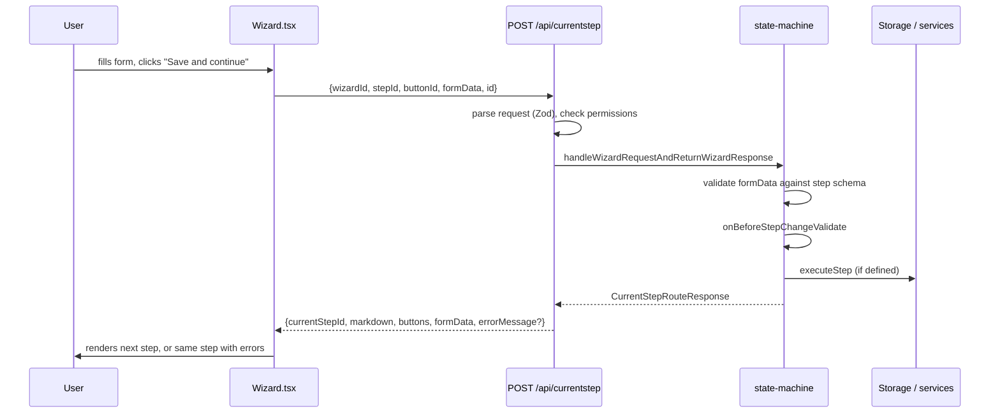

# State machine

How the UI wizards are defined, validated and driven by a single API route.

The UI is a set of wizards. [`libs/state-machine`](../libs/state-machine) is the generic engine; [`libs/newsletter-workflow`](../libs/newsletter-workflow) supplies the newsletter-specific definitions. See the [state-machine README](../libs/state-machine/README.md) for its own overview.

A wizard is just a record of steps:

```ts
// libs/state-machine/src/lib/types.ts
export type WizardLayout<
	T extends GenericStorageInterface = GenericStorageInterface,
> = Record<string, BaseWizardStepLayout<T>>;
```

Four wizards are registered in [`newsletter-workflow.ts`](../libs/newsletter-workflow/src/lib/newsletter-workflow.ts):

| Wizard id                        | Purpose                                          |
| -------------------------------- | ------------------------------------------------ |
| `NEWSLETTER_DATA`                | Create and edit a draft newsletter               |
| `NEWSLETTER_DATA_STAND_REDESIGN` | Variant behind the `switch-stand` feature switch |
| `LAUNCH_NEWSLETTER`              | Review a draft and launch it                     |
| `RENDERING_OPTIONS`              | Edit how the newsletter email renders            |

## `WizardStepLayout`

Each step declares its own label, copy, Zod schema, display hints and buttons. Buttons carry the navigation and the validation hooks:

```ts
export type WizardStepLayoutButton<
	T extends GenericStorageInterface = unknown,
> = {
	buttonType: WizardButtonType;
	label: string;
	stepToMoveTo: string | FindStepIdFunction;
	getNavigateTo?: (formData: WizardFormData | undefined) => string;
	onAfterStepStartValidate?: AsyncValidator<T> | Validator<T>;
	onBeforeStepChangeValidate?: AsyncValidator<T> | Validator<T>;
	executeStep?: AsyncExecution<T> | Execution<T>;
};
```

`stepToMoveTo` can be a function, so branching is expressed in the layout rather than in the UI. `executeStep` is where side effects happen — the launch wizard's `doLaunch` button is what calls `executeLaunch`.

## Validation

Validation runs on both sides, but only the server's is authoritative. The UI shows warnings as you type; the server re-validates on every button press in `validateIncomingFormData`:

```ts
// libs/state-machine/src/lib/utility.ts
const parseResult = formSchemaForIncomingStep.safeParse(formData);
if (!parseResult.success) {
	return {
		message: `VALIDATION ERRORS x${parseResult.error.issues.length}`,
		issues: parseResult.error.issues,
	};
}
```

On failure the response keeps `currentStepId` unchanged and carries `errorMessage` plus the Zod issues, so the UI simply re-renders the same step with the errors shown. Navigation and validation are the same round trip.

## The `currentStep` route

One endpoint drives every wizard: `POST /api/currentstep`, in [`apps/newsletters-api/src/app/routes/currentStep.ts`](../apps/newsletters-api/src/app/routes/currentStep.ts).



The server decides which step comes next; the UI just renders what it is given. The route creates a `LaunchService` for `LAUNCH_NEWSLETTER` and a `DraftService` for the others, so a wizard only gets the capabilities it needs.

On the UI side, `Wizard.tsx` holds the response and `SchemaForm` walks the Zod schema shape to build inputs, dispatching on Zod type — `ZodString` to a text input, `ZodEnum` to a select, `ZodBoolean` to a checkbox, and so on. `fieldDisplayOptions` on the step supplies hints such as `{ signUpDescription: { textArea: true } }`.

---

Part of the [newsletters-nx documentation](./README.md).
